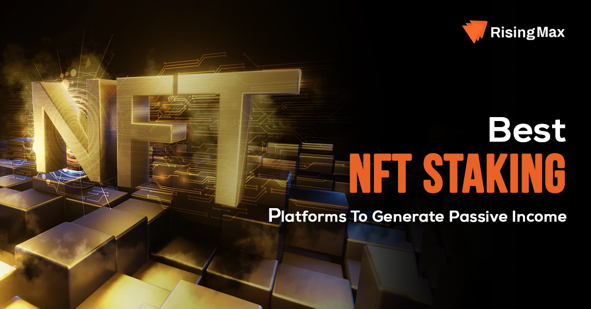

<h1 align="center">
  NFT-Staking ( NextJS + Ethers : Web3 )
   
</h1>

<h3>
Precisely the NFT-STAKING-PROJECT is an essential for blockchain developers.
</h3>

## Live Demo

Take a look the live demo here 👉 [https://cp_1_nft_staking.vercel.app/](https://coursespace.vercel.app/)

## Getting Started

I think you will all fully understand about the next.js and smart contracts.
So I am here to talk about the important things in developing.

1. High quality

Even you are a senior or beginner, this is the biggest problem.
While we are on the progress onto the next milestones or more higly designed backend modules are staying lazy & lazy designed backend modules are modified more than 10 times a day.
As the time goes by these kinds of modified codes are breaking the whole rules and eventually break the client's idea.

This is serious.
Even the smallest code that you have absolutely confidence, error comes in handy for that.

Be sure, keeping the high quality coding-spirit in your mind, in your heart.
Now then you will satisfy your Clients !

2. Responsibility

All people work at different levels of institutions as in the other areas of the world.
Everybody spends a time.
But why there's a change or difference among those volunteers?
Some developers work really hard but lower budget or else other developers work differently and they earn more than the previous.

The biggest point is Responsibility I think.
I don't guarantee all things are like this but I do say with some confidence that you must have responsibility.
You are responsible for the project for your client's idea to success.

Developer's life belongs to the CLIENT'S IDEA !

## Learn More

Lots of things to say but this time I will remind you the unique skills in Next.js

- SSR ( Server Side Rendering ) - learn more : [Next.js Documentation](https://nextjs.org/docs/pages/building-your-application/rendering/server-side-rendering)
- FSBR ( File System Based Routing) - learn more : [Next.js Documentation](https://nextjs.org/learn)

## Designed By

<h5 style = "color : blue; text-decoration : underline">
  CP : Senior Blockchain developer & Full Stack Engineering Specialist & Experienced Elasticsearch Engineer
</h5>

